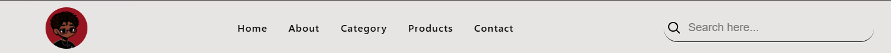
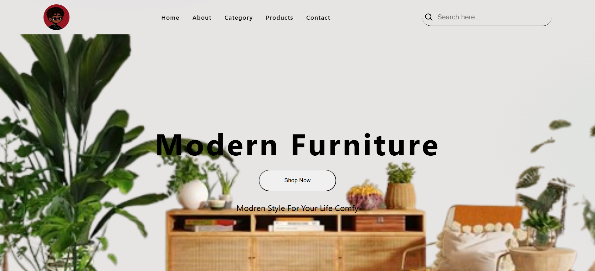
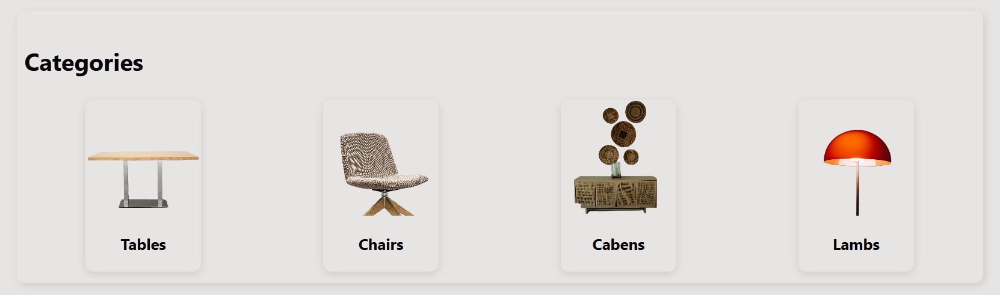
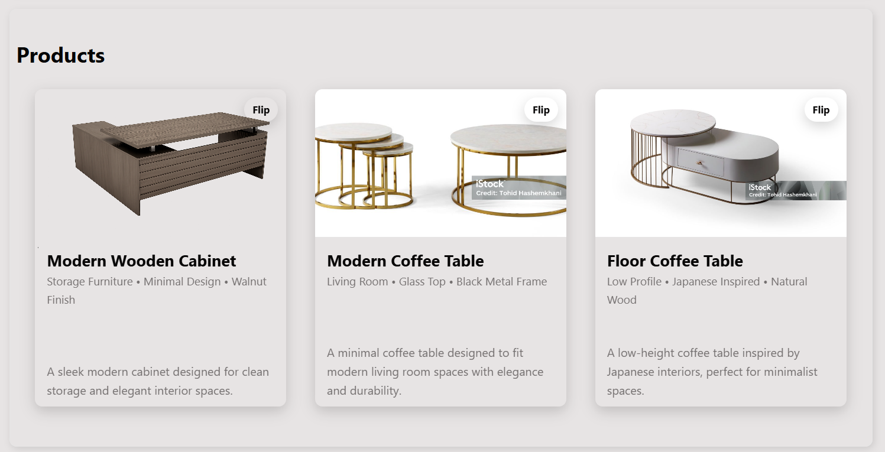
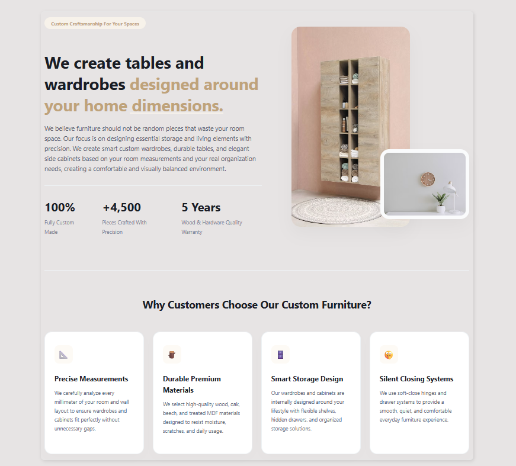

Markdown

# Modern Nest 🛋️

**Modern Nest** is my very first web development project built entirely from scratch after completing a comprehensive CSS course. The project is a clean, minimalist landing page for a modern furniture store, focusing on structured layout architecture, precise spatial proportions, and modern CSS techniques without using any JavaScript.

---

## 🚀 Features

- **Hero Section:** A sleek, minimalist welcoming area that showcases the brand identity with a prominent, styled Call-to-Action (CTA) button over an elegant interior backdrop.
- **About Section:** A highly detailed and structured section featuring a split-layout presentation. It includes an inspiring brand description, physical dimension statements, and interactive "Why Choose Us" feature highlights.
- **Categories Section:** Displays clean, isolated product category cards (Tables, Chairs, Cabinets, and Lamps) using a modern, rounded aesthetic.
- **Products Section (Flip Cards):** A fully responsive products grid featuring interactive cards engineered purely with HTML/CSS. The cards smoothly flip to reveal detailed dimensions and product metadata.
- **Contact & Footer:** A clean, direct contact section and a structured footer to complete the page anatomy.
- **Fully Responsive:** Adapts seamlessly across mobile devices, tablets, and desktops using advanced Flexbox layouts.

---

## 📸 Screenshots

### 🗺️ Navigation & Header Layout



### 🌿 Hero Section



### 📂 Product Categories



### 🛒 Interactive Product Cards Grid



### 📐 Detailed About Section & Core Values



---

## 📂 File Structure

The project directory is structured as follows:

```text
Modren Nest/
│
├── CSS/
│   └── style.css          # Main stylesheet housing all layout and card transition rules
│
├── Icons/
│   └── Search.svg         # Search icon vector utilized in the header nav
│
├── Images/                # General asset directory (logo, categories, and about images)
│
├── Products-Images/       # High-quality image assets designated for the product grid
│
├── docs/                  # Documentation folder
│   └── screenshots/       # Project screenshots for this README
│       ├── navbar-desktop.png
│       ├── hero.jpg
│       ├── cartegory.png
│       ├── products.jpg
│       └── About.png
│
├── Main Page.html         # Main HTML document and semantic core of the website
└── README.md              # Project documentation (this file)
🛠️ Technologies Used
HTML5: For clean, accessible, and Semantic HTML structures.

CSS3: For modern styling, layouts (Flexbox), custom variables, and 3D card flipping transitions (transform, backface-visibility).
## 👤 Author

**Naji Hamed**
Self-Taught C# Backend & Desktop Developer, currently expanding into Frontend Development.

This project is part of my journey to strengthen my frontend skills by building responsive, modern, and accessible web interfaces from scratch using HTML and CSS.

GitHub: @SilentDev-Na

Repository: css-playground
```
