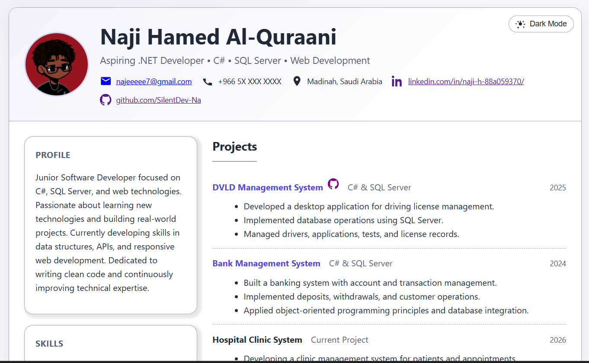
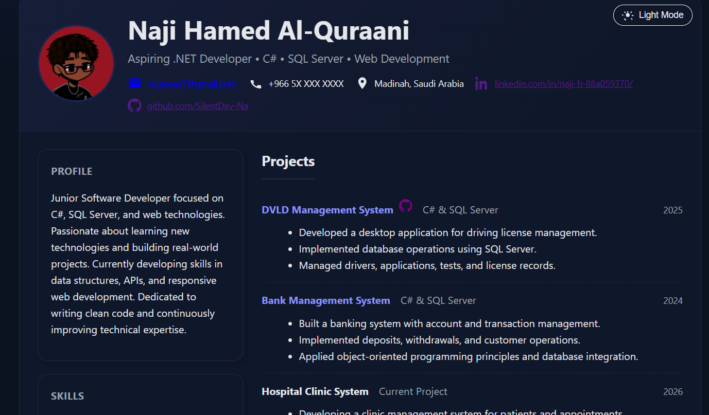
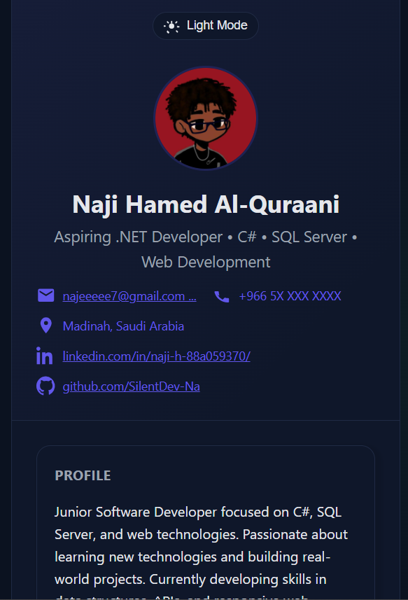

# CV Project 01

A modern and responsive CV website built with HTML, CSS, and JavaScript.

## Features

- Responsive Design
- Dark / Light Mode Toggle
- Print-Friendly Layout
- Project Showcase Section
- Skills & Certifications Sections
- GitHub Project Links
- Accessible HTML Structure

## Screenshots

### Light Mode

### Dark Mode

### Mobile Layout

## Technologies Used

- HTML5
- CSS3
- JavaScript
- CSS Grid
- Flexbox

## Author

**Naji Hamed Al-Quraani**

- GitHub: https://github.com/SilentDev-Na
- LinkedIn: https://www.linkedin.com/in/naji-h-88a059370/
