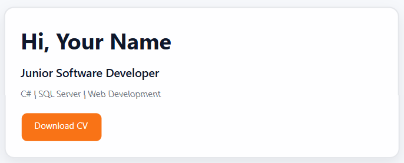
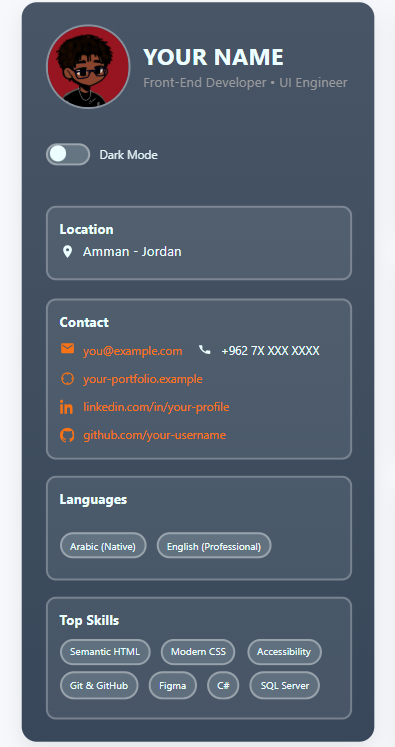
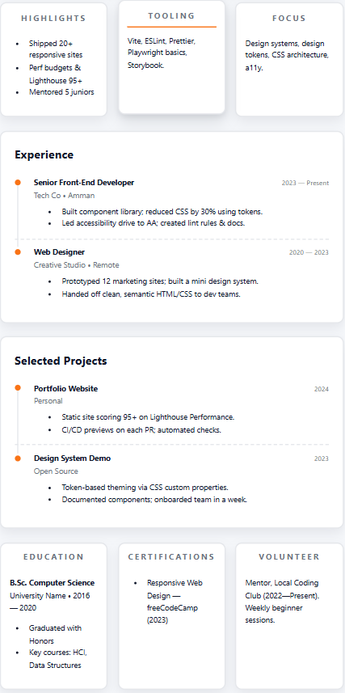
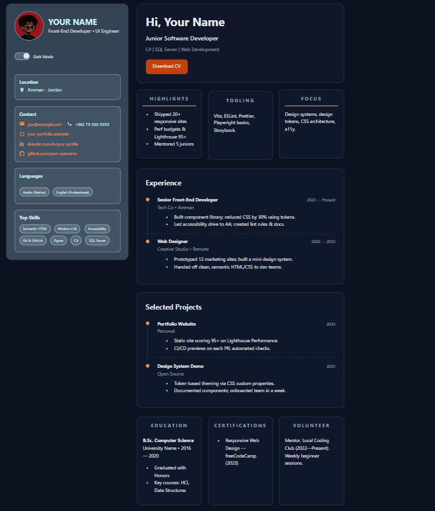

# Modern Resume Website

A responsive resume website built with HTML and CSS.

This project started as a course template, but I customized and enhanced multiple parts of the design and user experience to better understand modern CSS concepts and front-end development practices.

## Features

* Responsive layout using CSS Grid
* Sticky sidebar navigation
* Pure CSS Dark Mode Toggle using `:has()`
* CSS Custom Properties (Design Tokens)
* Interactive hover animations
* Timeline-style Experience and Projects sections
* Download CV button with custom hover effect
* SVG icons for contact information
* Print-friendly layout
* Accessible semantic HTML structure

## Improvements I Added

### UI Enhancements

* Redesigned color system with additional design tokens
* Improved typography and spacing
* Added hover effects for cards, buttons, links, and avatar image
* Added animated underline effects

### Timeline Design

* Created a visual timeline using CSS pseudo-elements
* Added timeline indicators and connecting lines

### Contact Section

* Improved icon and text alignment using Flexbox
* Added interactive hover feedback

### Dark Mode

* Enhanced dark mode color palette
* Added theme-specific variables for better maintainability

## Technologies Used

* HTML5
* CSS3
* CSS Grid
* Flexbox
* CSS Variables
* Pseudo-elements (`::before`, `::after`)
* CSS `:has()` selector

## What I Learned

Through this project I practiced:

* Working with an existing codebase
* Reading and understanding unfamiliar code
* Refactoring CSS safely
* Building reusable design systems with CSS variables
* Creating responsive layouts
* Improving UI/UX through small design details
* Using modern CSS features in real projects

## Future Improvements

* Add JavaScript theme persistence
* Add smooth scrolling navigation
* Add project filtering section
* Add animations on scroll
* Convert the project into a personal portfolio website

## Preview

### Hero Section

### Sidebar

### Main Content

### Dark Mode

## Author

Naji Hamed

GitHub: https://github.com/SilentDev-Na
